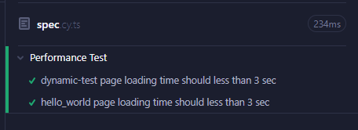

## 使用時機

當有多個項目需要測試，並且測試內容大致相同。

## 使用方法

假設今天要測試兩個頁面的載入時間，將這兩個頁面分別寫 `it` 是沒有問題的，但當測試的頁面一多就需要一直增加，顯然會增添後續維護的困難性。

`Cypress` 實際上就是 `Javascript`，因此直接使用傳統的 `for loop` 或是 `forEach()` 動態生成測試項目即可。

```ts
describe("Performance Test", () => {
  const requiredPages = [
    { name: "dynamic-test" },
    { name: "hello_world" },
  ];

  requiredPages.forEach(({ name }) => {
    it(`${name} page loading time should less than 3 sec`, () => {
      cy.intercept("GET", `/${name}`).as("queryPage");
      cy.visit(`/${name}`);
      cy.wait("@queryPage", { timeout: 3000 })
        .its("state")
        .should("equal", "Complete");
    });
  });
});
```

在`Cypress`上可以看到總共有兩個 test：



## 為什麼不將 `for` 寫在 `it` 裡面呢?

今天的需求是要測試個別頁面的載入速度，如果將迴圈寫在 `it` 裡面，當前面的測試失敗了，程式會直接拋出錯誤，後面的測試就不會執行了。

因此，將 `it` 寫在迴圈裡才是較符合需求的作法。
